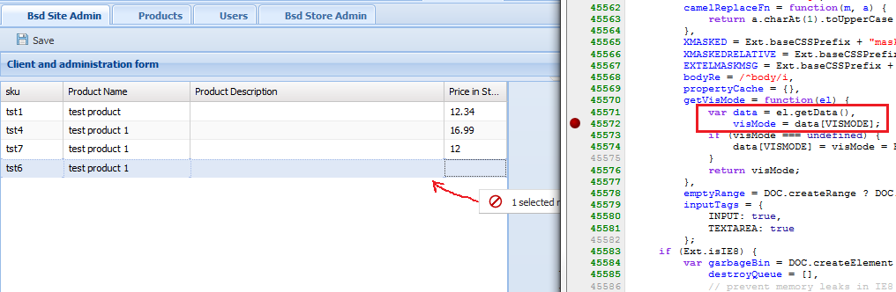
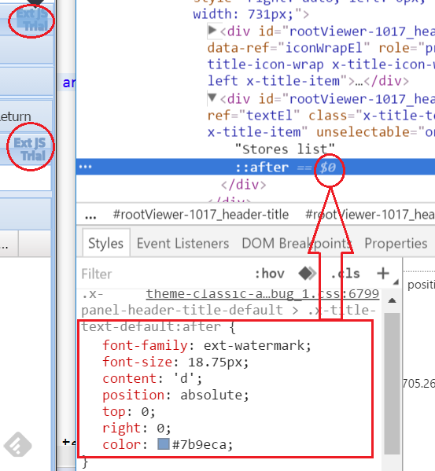
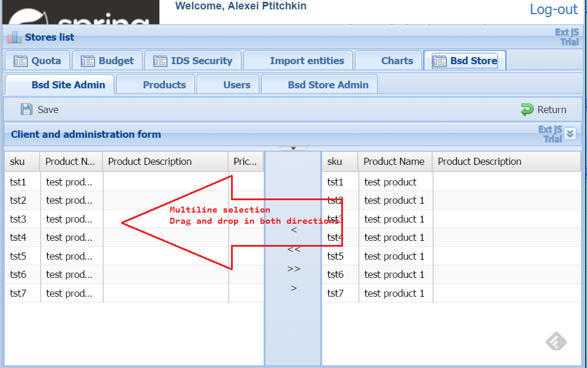

# Mock project
---
### September 5
commit unstaged Changes to new branch GsonNotCompleted (Abandoned)

### TODOs 

1. TODO - <AP>: Switch from gson to jackson

	@Service class ApplicationConfigurationService already imports flexjson.JSONDeserializer

2. TODO - <AP>: TBR org/avp/quota/kpi/web/configuration/WebSecurityConfig:customAuthenticationProvider()
3. TODO - <AP>: later need to build separate org/avp/security jar project
4. TODO - <AP>: rename BsdController to ?_BsdSiteAdminUIController?_ 
5. TODO - <AP>: rename BsdClientController to ?_BsdClientUIController?_
6. TODO - <AP>: Really need to understand how to resolve conflicts in _github merging_ 
7. TODO - <AP>: Should I make extJs form submit json in bsd/update* ?
8. On ManageStore form add buttons between 'left one pointed to products within store' AND 'right one pointed to products globally available but not assigned to selected store' grids

8.1. `[>]`,`[>>]` - move product/_group of_ from left to right (delete product from store)
8.2. `[<]`,`[<<]`- move product/_group of_ from right to left (add product to store)

9. both grids have filter entry field in toolbar and beside it [clear filter] button enabled when filter is active
10. Error highlighting in empty product price cell is disabled(due dragManager still working and conflict with cell editor)
		
		TypeError: data is undefined
		visMode = data[VISMODE];
		
		TypeError: Argument 1 of Node.insertBefore is not an object.
		cell.dom.insertBefore(editor.el.dom, cell.dom.firstChild);

	
11. On angular client Product page need add [Refresh] button 
12. move FilterParameterExtJs6 from service to web project

---

- Remove ExtJs Trial water mark

- Store management page layout
 

# Test database

- select tables populated @ build

	SELECT * FROM gitmockauth.users;
	SELECT * FROM gitmockauth.orders;
	SELECT * FROM gitmockauth.stores;
	SELECT * FROM gitmockauth.products;
	SELECT * FROM gitmockauth.productpriceinstore;

# References

1. Eclipse TypeScript Plug-in

An Eclipse [plug-in for developing in the TypeScript language](https://github.com/palantir/eclipse-typescript)
_Installation_

- Install Node.js
- Open Eclipse and go to Help->Install New Software
- Add the update site: http://eclipse-update.palantir.com/eclipse-typescript/
- Reboot Eclipse
- (optional) Right-click on a project and select Configure->Enable TypeScript Builder

2. What to choose in subclasses assign BUILD_DATABASE flag _OR_ use abstract method to override in subclasses
2.1. Google: `java can I assign const in subclass`

2.1.1. Best [http://stackoverflow.com/questions/8467494/overriding-constants-in-java](http://stackoverflow.com/questions/8467494/overriding-constants-in-java)
2.1.2. Force subclasses to include constant in abstract java class [stackoverflow](http://stackoverflow.com/questions/11896955/force-subclasses-to-include-constant-in-abstract-java-class)

2.1.3 Also good to read:

- [petrikainulainen abstract test classes](https://www.petrikainulainen.net/programming/testing/writing-clean-tests-it-starts-from-the-configuration/)
- [http://stackoverflow.com/questions/2211002/why-not-abstract-fields](http://stackoverflow.com/questions/2211002/why-not-abstract-fields)

3. [multiple instances of same grid](http://stackoverflow.com/questions/15777134/ext-js-multiple-instances-of-same-grid)
4. [Why are Data Transfer Objects an anti-pattern?](http://stackoverflow.com/questions/1440952/why-are-data-transfer-objects-an-anti-pattern)
5. [Spring 3.1 JSON date format](http://stackoverflow.com/questions/9038005/spring-3-1-json-date-format) from src [How to control Date formatting when Jackson JSON Processor is used with Spring 3.0](http://blog.seyfi.net/2010/03/how-to-control-date-formatting-when.html)

## An Angular related reading

- [es6-shim](http://stackoverflow.com/questions/35642223/angular2-why-do-we-need-the-es6-shim)
- [reflect-metadata](https://www.google.com/search?q=reflect-metadata+angular2&oq=reflect-metadata&aqs=chrome.4.69i57j0l5.6943j0j9&sourceid=chrome&ie=UTF-8)
- [rxjs](https://www.sitepoint.com/functional-reactive-programming-rxjs/)
- [systemjs](https://www.google.com/search?q=systemjs+vs+webpack&oq=systemjs&aqs=chrome.1.69i57j0l5.6671j0j7&sourceid=chrome&ie=UTF-8)
- [zone.js](https://medium.com/@MertzAlertz/what-the-hell-is-zone-js-and-why-is-it-in-my-angular-2-6ff28bcf943e#.fepfp1ads)

---

## Setup node_modules

- to update node package manager (npm) 

	- run `npm -v` to confirm current version  
	- in terminal window run `npm install npm -g`
	- run `npm -v` again confirm output 3.10.5 (means npm had been updated)

- after webpack optimization step completed it is essential to run _bundling and deployment_ after each typescript modification in MockWebExtJs6_bsd/src/main/webapp/resources

	>[optional] delete _node_modules_ folder
	>[optional] npm install
	>[optional] delete _dist_ folder
	>npm run build
	>refresh MockWebExtJs6_bsd/src/main/webapp/resources folder. Otherwise STS will not pickup new bundle 

- in _src/main/webapp/resources/_ run npm install this will create `node_modules` folder with all required dependencies

---
