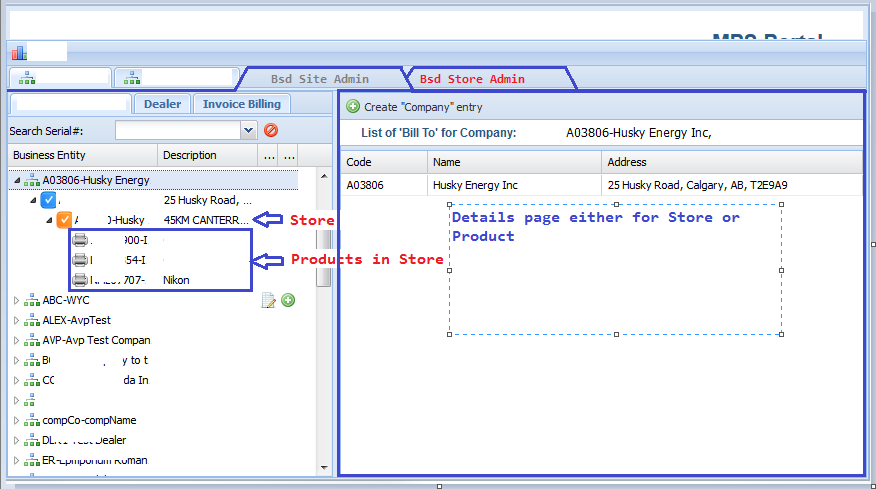

## TODOs 

1. TODO - <AP>: Switch from gson to jackson

- @Service class ApplicationConfigurationService already imports flexjson.JSONDeserializer

2. TODO - <AP>: TBR org/avp/quota/kpi/web/configuration/WebSecurityConfig:customAuthenticationProvider()
3. TODO - <AP>: later need to build separate org/avp/security jar project
4. TODO rename BsdController to ?_BsdSiteManagementController?_ 
5. TODO rename BsdClientController to ?_BsdClientUIController?_

---
### August 23

---
committed

- Extract angular requests from BsdController to BsdClientController
- implement server side @RequestMapping(value={"/bsd/stores"}, method=RequestMethod.GET)
- implement browser side basic grid/model/store/controller 

---
committed

- Add Draft Bsd Site Viewer with SiteGrid (no server requests for data)
- ExtJs SiteAdmin and StoreAdmin page (myself for now)   
- Very draft look&feel 

---
committed

#### Problem:  currently project have one _DataBase_ configuration for build _DataBase_ and for run web application

Solution    

- create `AbstractTomcatDataServiceModuleConfiguration` with abstract boolean isInBuildMode()
- for normal validation test cases use `TomcatDataServiceModuleConfiguration` _extends AbstractTomcatDataServiceModuleConfiguration implement isInBuildMode(){return false;}_  
- for dangerous build database test cases use `TomcatDataServiceModuleConfiguration` _extends AbstractTomcatDataServiceModuleConfiguration implement isInBuildMode(){return true;}_

 
- ? _use different profiles to build database and run tests_ ?

---
### August 22

committed:

- Break src/test/java/org/avp/quota/kpi/service/ValidateDatabase.java to ValidateBsdTables and ValidateQuotaTables

committed:

- retrieve orders for user
	List<OrderHeaderDto> getOrders()
		BsdUser user = (BsdUser) session.getAttribute("appuser");
		List<OrderHeader> orders = bsdService.getOrderHeadersByUser(user);

committed:

- remove direct use of UserRepository, use CustomUserService instead (QuotaService and BsdService may use CustomUserService as front-end instead of directly request repository)

committed:

- remove package org/avp/quota/kpi/model/security (all security related service/entity/repositories moved under org/avp/security package. __later need to build separate jar project__)
- remove package org/avp/quota/kpi/repository/security (same reason as above)
- replace BsdUserRepository & IUserRepository with org/avp/security/repository/UserRepository.java from common security package
- remove BsdUserRepository & IUserRepository

committed:

- add `Authentication authentication` parameter to all methods in src/main/java/org/avp/quota/kpi/web/web/IndexController.java to store User profile in session
- remove  `Authentication authentication` from BsdController to rely on session previously stored User profile
- add `HttpSession session` arg-t to bsdController to retrieve previously stored user

committed:

- TODO - <AP>: missing resources requested from login jsp
- remove references to old bootstrap distribution from MockWebExtJs6_bsd/src/main/webapp/WEB-INF/jsp/loginBody.jsp

	"NetworkError: 404 Not Found:
	- MockWebExtJs6_bsd/resources/lib/bootstrap/dist/css/bootstrap.min.css"
	- MockWebExtJs6_bsd/resources/lib/bootstrap-additions/dist/bootstrap-additions.min.css"
	- MockWebExtJs6_bsd/resources/lib/angularjs-toaster/toaster.min.css"
	- MockWebExtJs6_bsd/resources/lib/ladda/dist/ladda-themeless.min.css"

committed:

- add "log4j.logger.com.google.gson=DEBUG" to src/test/resources/log4j.properties and src/main/resources/log4j.properties
- rename test logging output to MockStub`Test`.log
- remove struts2 logging log4j.logger.com.opensymphony.xwork2=ERROR, ROLLING_FILE, stdout
---
### August 21

- pass Authentication to action method to access user
- refine test case to correctly populate bsd database
- add test ValidateDatabase to validate only (no database rebuild)
- add ProductDto and createProductDto(...) in DtoFactory

Committed:

- refactor build database
- fix the mess after merge in readme

---
### August 19
Google: spring security access/retrieve user object
- Read http://www.baeldung.com/get-user-in-spring-security
- Read http://stackoverflow.com/questions/8764117/spring-3-spring-security-extract-authenticated-user-object

	Authentication a = SecurityContextHolder.getContext().getAuthentication();
	User currentUser = (User)a.getPrincipal();
	
y-extract-authenticated-user-object
Google: spring security access/retrieve user object
Read http://stackoverflow.com/questions/8764117/spring-3-spring-security-extract-authenticated-user-object

	Authentication a = SecurityContextHolder.getContext().getAuthentication();
	User currentUser = (User)a.getPrincipal();
	

---	
### August 18
- orders not rendered because of circular reference 
- introduce orderHeaderDto without circular references

#### TODOs for the day

- request /angular/orders List<OrderHeader> getOrders reads orders but fail on converting response to json

---
### August 17

- change security tag attribute "hasRole() or hasRole()" to hasAnyRole(list of roles)  

	<%-- <security:authorize access="hasRole('QuotaKPI_ADMIN_ANGULAR') or hasRole('BSD_DEALER')"> --%>
	<security:authorize access="hasAnyRole('QuotaKPI_ADMIN_ANGULAR', 'BSD_DEALER')">
	<c:redirect url="/clientStore"/>
	</security:authorize>

- Link org/avp/bsd/model/BsdUser with Store and OrderHeader 

1. Store one-to-many BsdUser
2. BsdUser one-to-many OrderHeader
3. OrderHeader one-to-many OrderDetails

---
### August 16

- fix mess with security/user services
	
	- rename MockServiceExtJs6_bsd/src/main/java/org/avp/security/repository/IAuthoritiesRepository to AuthoritiesRepository
	- move security related entities/repositories and service to MockServiceExtJs_bsd
	- add dependency for org.springframework.security to MockServiceExtJs_bsd
		<dependency>
			<groupId>org.springframework.security</groupId>
			<artifactId>spring-security-web</artifactId>
			<version>${spring.security.version}</version>
		</dependency>
		
		<dependency>
			<groupId>org.springframework.security</groupId>
			<artifactId>spring-security-crypto</artifactId>
			<version>${spring.security.version}</version>
		</dependency>
		
	- move them under security domain avp.security.service.SecurityService
	- MockWebExtJs6_bsd/src/main/java/org/avp/quota/kpi/web/service/CustomUserService.java
	- move avp/quota/kpi/service/interfaces/QuotaService:save(User user);
	- test that one avp.security.repository.UserRepository is enough
		- avp.bsd.repository.BsdUserRepository for BsdUser
		- avp.quota.kpi.repository.IUserRepository for QuotaUser
		- avp.quota.kpi.repository.security.UserRepository for User
	- move User under security domain avp.security.model from org.avp.quota.kpi.model.security

- __Side note__ : datatables.net

	C:\Tmp\npmTmp>npm init
	This utility will walk you through creating a package.json file.
	It only covers the most common items, and tries to guess sensible defaults.
	
	See `npm help json` for definitive documentation on these fields
	and exactly what they do.
	
	Use `npm install <pkg> --save` afterwards to install a package and
	save it as a dependency in the package.json file.
	
	Press ^C at any time to quit.
	name: (npmTmp)
	Sorry, name can no longer contain capital letters.
	name: (npmTmp) dymmy_project
	version: (1.0.0)
	description: dymmy project
	entry point: (index.js)
	test command:
	git repository:
	keywords:
	author:
	license: (ISC)
	About to write to C:\Tmp\npmTmp\package.json:
	
	{
	  "name": "dymmy_project",
	  "version": "1.0.0",
	  "description": "dymmy project",
	  "main": "index.js",
	  "scripts": {
	    "test": "echo \"Error: no test specified\" && exit 1"
	  },
	  "author": "",
	  "license": "ISC"
	}
	
	
	Is this ok? (yes) y
	
	C:\Tmp\npmTmp>npm install datatables.net --save
	dymmy_project@1.0.0 C:\Tmp\npmTmp
	`-- datatables.net@1.10.12
	  `-- jquery@3.1.0
	
	npm WARN dymmy_project@1.0.0 No repository field.
	
	C:\Tmp\npmTmp>npm install datatables.net-bs --save
	dymmy_project@1.0.0 C:\Tmp\npmTmp
	`-- datatables.net-bs@1.10.12
	npm WARN dymmy_project@1.0.0 No repository field.
	C:\Tmp\npmTmp>

---
### August 15

Fix mess with user accounts (user, bsduser, quota user), roles, user_roles, roles_priveleges, authorities etc.

For JPA inheritance types look at [JPA blog](http://www.thejavageek.com/jpa-tutorials/)
- [JPA table per concrete class example](http://www.thejavageek.com/2014/05/17/jpa-table-per-concrete-class-example/)
- [JPA Joined Inheritance Example](http://www.thejavageek.com/2014/05/17/jpa-joined-inheritance-example/)

- UserDao(quotaUser) BsdUser(users) extend org/avp/quota/kpi/model/security/User (hibernate inheritance)
- move BsdUser.email .etc to org/avp/quota/kpi/model/security/User (org/avp/quota/kpi/model/dao/UserDao) 
- make login against org/avp/quota/kpi/model/security/User instead of org/avp/quota/kpi/model/dao/UserDao 

Refactor AuthoritiesDao
- move AuthoritiesDao.java from _org/avp/quota/kpi/model/dao_ to _org/avp/quota/kpi/model/security/_
- rename AuthoritiesDao to Authority
- change AuthoritiesDao.user from type QuotaUser to org/avp/quota/kpi/model/security/User

### Angular mile stone v0.1.0.4
- AngularJs UI removed
- introduce ProductPriceInStore entity to link product and store
- updated test case to build database with Store and ProductPriceInStore

---
###  August 12

### Angular mile stone taken before removing AngularJs UI v0.1.0.3
- server side reading for products and orders
- three routes for product list, product detail and order list
- draft bootstrap orders table

---
### August 10

- to work on orders route
- create store <- prdInStore -> product

---
### August 09

Read products cause error in parsing standard json response

	map(response => response.json())

in home.ts change
 
      

        <auction-product-item [product]="product"></auction-product-item>
      

to

      

        <auction-product-item [product]="product"></auction-product-item>
      

---
# References

1. Eclipse TypeScript Plug-in

An Eclipse [plug-in for developing in the TypeScript language](https://github.com/palantir/eclipse-typescript)
_Installation_

- Install Node.js
- Open Eclipse and go to Help->Install New Software
- Add the update site: http://eclipse-update.palantir.com/eclipse-typescript/
- Reboot Eclipse
- (optional) Right-click on a project and select Configure->Enable TypeScript Builder

2. What to choose in subclasses assign BUILD_DATABASE flag _OR_ use abstract method to override in subclasses
2.1. Google: `java can I assign const in subclass`

2.1.1. Best [http://stackoverflow.com/questions/8467494/overriding-constants-in-java](http://stackoverflow.com/questions/8467494/overriding-constants-in-java)
2.1.2. Force subclasses to include constant in abstract java class [stackoverflow](http://stackoverflow.com/questions/11896955/force-subclasses-to-include-constant-in-abstract-java-class)

2.1.3 Also good to read:

- [petrikainulainen abstract test classes](https://www.petrikainulainen.net/programming/testing/writing-clean-tests-it-starts-from-the-configuration/)
- [http://stackoverflow.com/questions/2211002/why-not-abstract-fields](http://stackoverflow.com/questions/2211002/why-not-abstract-fields)

---

## Setup node_modules

- to update node package manager (npm) 

	- run `npm -v` to confirm current version  
	- in terminal window run `npm install npm -g`
	- run `npm -v` again confirm output 3.10.5 (means npm had been updated)

- in _src/main/webapp/resources/_ run npm install this will create `node_modules` folder with all required dependencies

---
