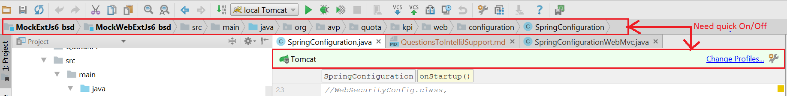
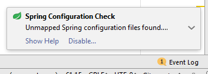
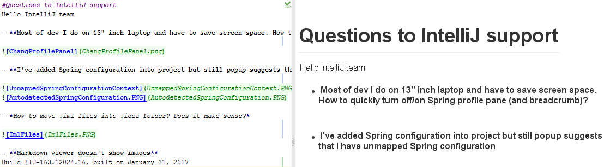

#Questions to IntelliJ support
Hello IntelliJ team

- **Most of dev I do on 13" inch laptop and have to save screen space. How to quickly turn off/on Spring profile pane (and breadcrumb)?**

- **I've added Spring configuration into project but still popup suggests that I have unmapped Spring configuration**

  

- *How to move .iml files into .idea folder? Does it make sense?*

- **Markdown viewer doesn't show images**
Build #IU-163.12024.16, built on January 31, 2017

