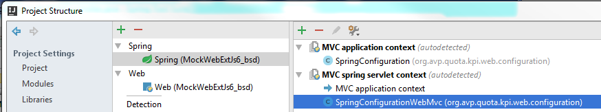

#Questions to IntelliJ support
Hello IntelliJ team

- most of dev I do on 13" inch laptop and have to save screen space. How to quickly turn off/on Spring profile pane (and breadcrumb)?

- I've added Spring configuration into project but still popup suggests that I have unmapped Spring configuration
  

