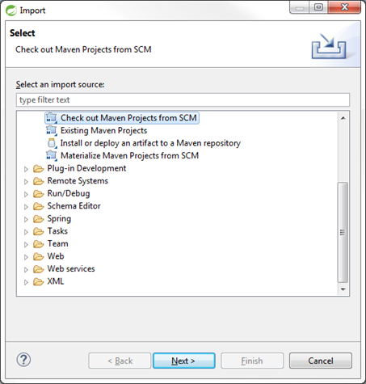
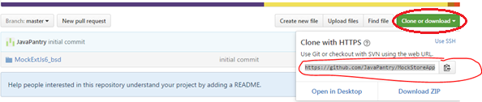
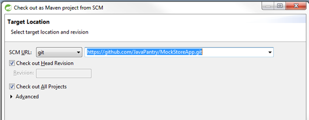

# Dummy Mock project

This is playground to be used as start for new projects 

## Quick start
- in MockServiceExtJs6_bsd/src/main/java/org/avp/quota/kpi/configuration/TomcatDataServiceModuleConfiguration.java change hibernate setting to create database from scratch 

	Properties getJpaProperties() {
		Properties properties = new Properties();
		properties.setProperty("hibernate.hbm2ddl.auto", "validate");//Select: "create" OR "validate" OR "default"
 
- run MockWebExtJs6_bsd/src/test/java/org/avp/quota/kpi/service/BuildAndExportDatabase.java as jUnit test
- confirm success and check database populated

## User Interface

- ExtJs6 (v 6.x)
- AngularJs (AngularJs I) replaced with Angular II

## import from Github

- File->Import->Maven->Checkout Maven project from SCM

- Copy repository url

 
- Paste repository url in target and click [Finish]

 

- You should see the start of build
- Click on web project and select debug on server

This is "Thymeleaf_branch" branch

- remove web.xml
    Cannot initialize context because there is already a root application context present - check whether you have multiple ContextLoader* definitions in your web.xml!
    http://stackoverflow.com/questions/22729725/why-this-spring-application-with-java-based-configuration-dont-work-properly

- How to set active profile without web.xml
    https://dzone.com/articles/using-spring-profiles-and-java
    